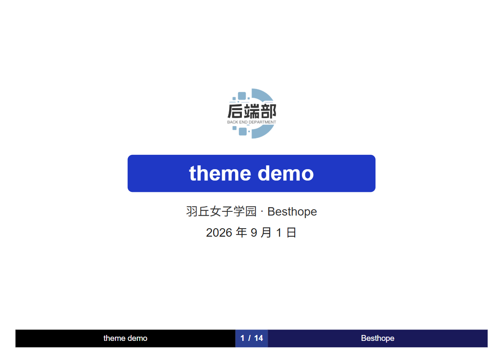
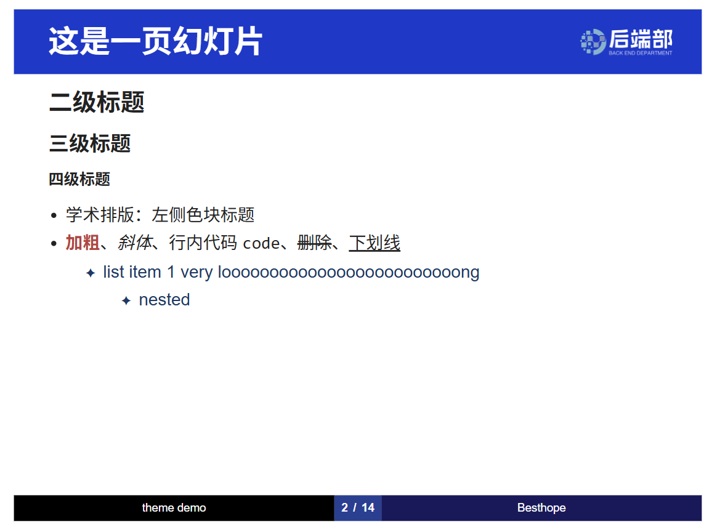
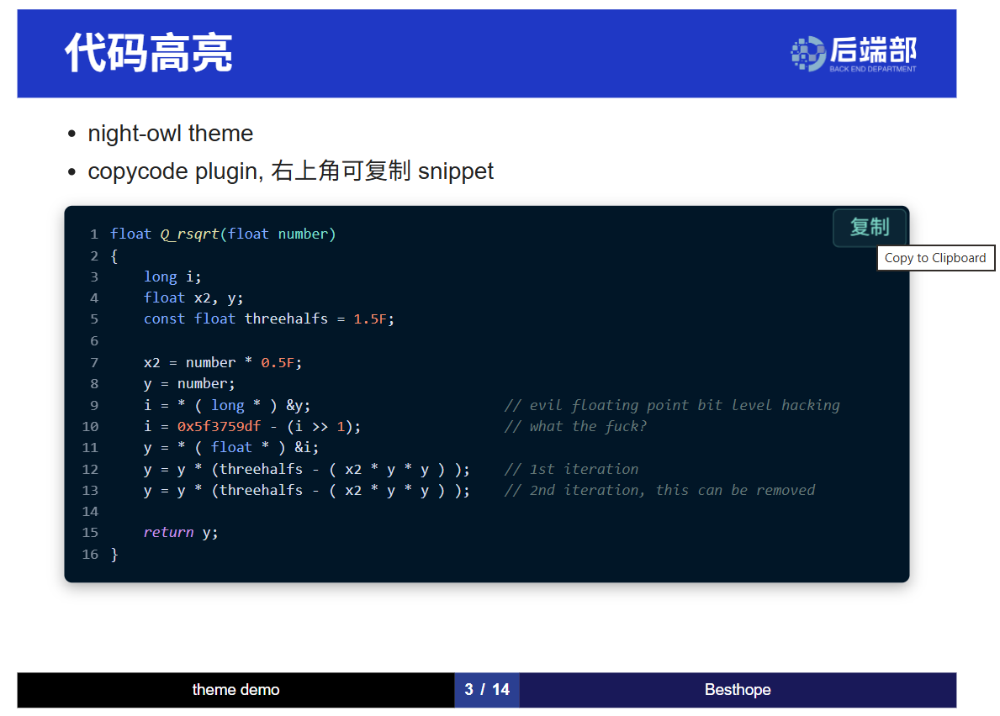
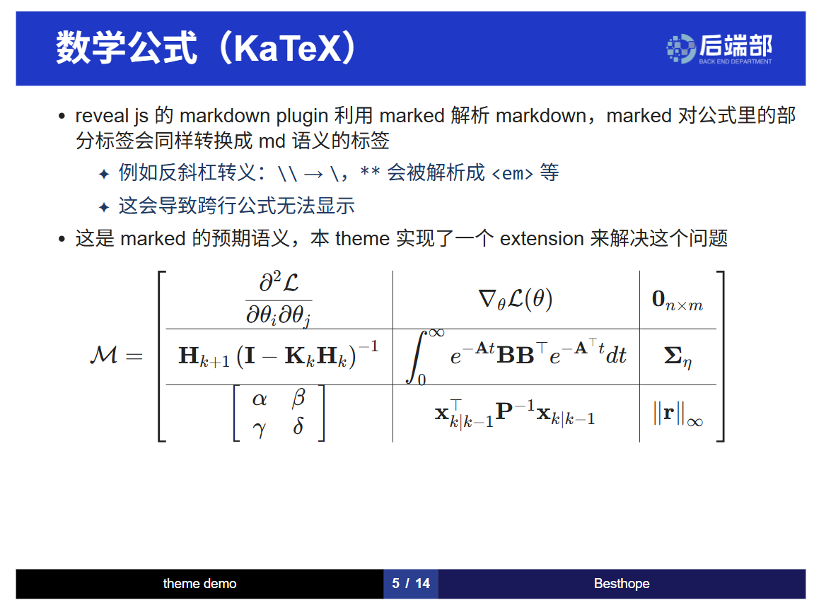
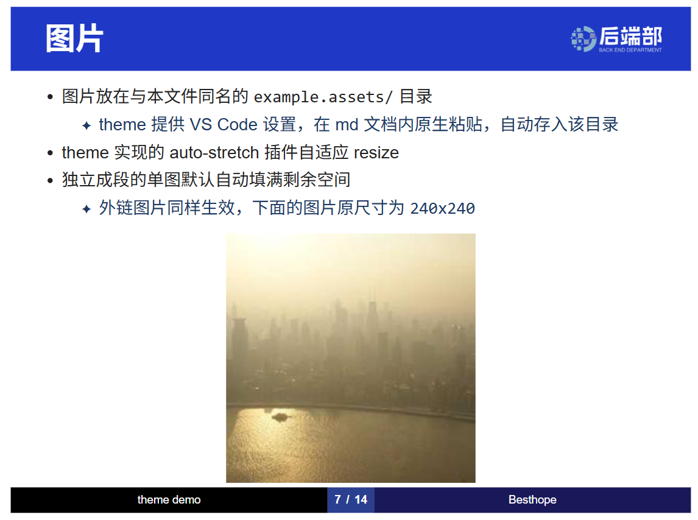

# revealjs-academic-theme


中文 | [English](/docs/README-en.md)

[Live demo on Github Page](https://Besthope-Official.github.io/revealjs-academic-theme/example)



## 介绍

开箱即用的 reveal.js 学术主题

特性:

- **学术主题**: LaTeX Beamer 风格标题块、自动页脚、KaTeX 公式（解析增强）、图片自适应 resize、night-owl 代码高亮
- **简化配置**: 约定了一套内容生产与组织方式、快速产出 dist 部署

## 快速开始

```bash
pnpm install       # install revealjs
pnpm dev           # go to http://localhost:4173/example to see a live demo
```

## 主题配置

在 assets 下放你希望展示的 logo，例如学校校徽，区分扁平样式和正常样式，推荐透明背景.

## Frontmatter 配置

每一个 md 页都可以单独配置 frontmatter 来控制页面的主标题和机构、作者

```yaml
title: theme demo
institute: 羽丘女子学园
author: Besthope
```

## 演示

多级标题



代码



公式



图片


