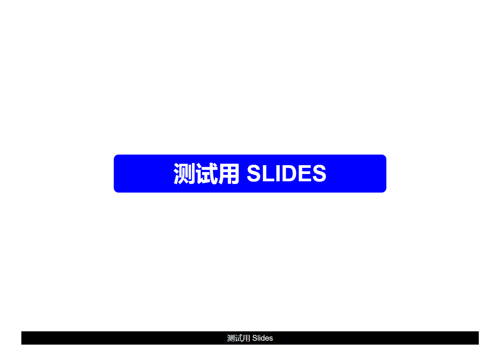
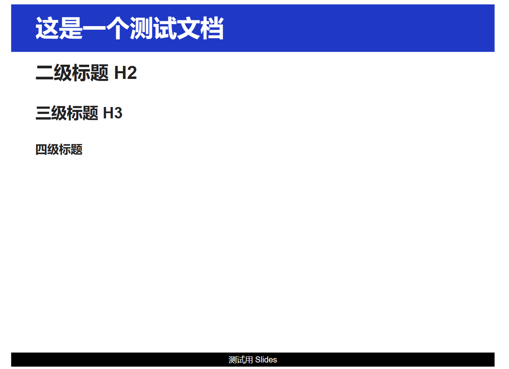
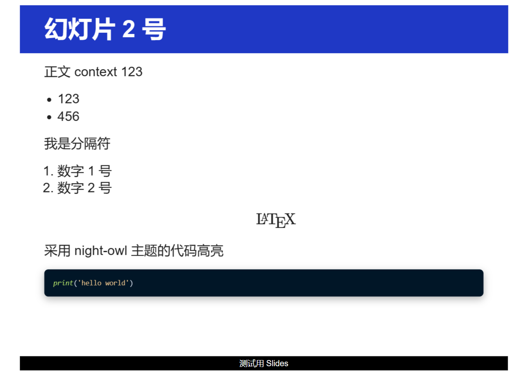

# revealjs-academic-theme

## 介绍

reveal.js 的一个幻灯片主题与模板

特性:

- **自定义幻灯片主题**: 更适合学术汇报/上课用PPT/学习笔记
- **可插入页面**: 导出页面经部署可作为 iframe 插入例如 blog
- 高度**个性化**: 按需编辑模板以及主题样式
- 集成了**自动化工具**: 自动导出相关格式文件

## 使用方法

1. 完整安装 reveal.js (需要 Node.js 10.0.0+环境)

```bash
git clone https://github.com/hakimel/reveal.js.git
cd reveal.js && npm install
```

2. 将 `styles` 目录下的 `slides.css` 拖放到 `dist/theme` 目录下

3. 编写 markdown 文档头

```yml
---
title: 这里编写你的标题
---
```

4. 运行命令

```bash
./md2slides.py <your_markdown_file>.md
```

5. 在 `output` 目录下就会显示生成的 html 文件和 md 文件

6. 将对应得到的文件放到 `reveal.js` 目录下, 运行命令

```bash
npm start
```

就可以看到你的幻灯片了.

如果你愿意, 你可以将导出文件的目录直接指定为 reveal.js, 这样就可以省去复制粘贴的工作了

## 演示

PPT 标题 & 自动生成脚注



多级标题



正文效果



TBD

## 配置

你可以在 template 中修改 markdown 分隔符的格式, 默认如下

```html
<section data-markdown="*.md"
       data-separator="^<!-- slide -->"
       data-separator-vertical="^<!-- vslide -->">
</section>
```
